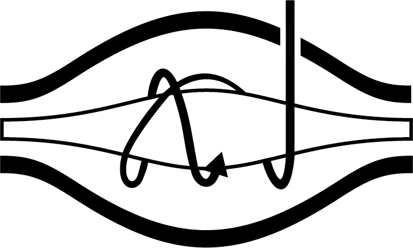

<!-- README.md is generated from README.Rmd. Please edit that file -->

# r-mass-spectrometry-tools

<!-- badges: start -->

<!-- badges: end -->

The goal of r-mass-spectrometry-tools is to house functions for
processing mass spectrometry data.

